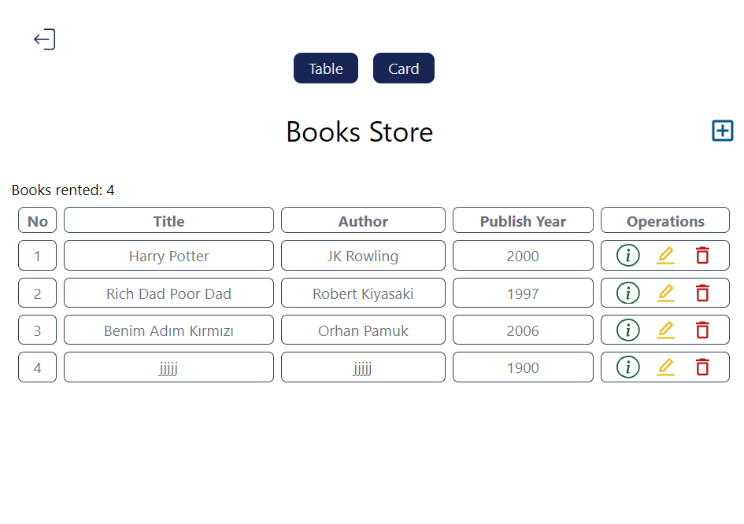

# BookStore MERN Stack Application

This is a full-stack web application for managing a bookstore, built using the **MERN stack** (MongoDB, Express.js, React.js, Node.js). The application allows users to register, log in, and manage books (add, edit, delete, and view details). It also provides a responsive UI with table and card views for displaying books.

## Features

### Backend
- **User Authentication**: Register and log in with username and password.
- **Book Management**: Add, edit, delete, and view books.
- **RESTful API**: Built with Express.js and Mongoose for MongoDB.
- **Database**: MongoDB Atlas for storing user and book data.
- **CORS**: Configured to allow requests from the frontend.

### Frontend
- **React.js**: Built with React and Vite for fast development.
- **Routing**: React Router for navigation between pages.
- **Responsive Design**: Tailwind CSS for styling and responsive layouts.
- **Notifications**: `notistack` for success and error messages.
- **Icons**: `react-icons` for interactive UI elements.

## Project Structure

### Backend
```
server/
├── config.js          # Configuration (e.g., PORT, MongoDB URL)
├── index.js           # Entry point for the Express server
├── models/            # Mongoose schemas for User and Book
│   ├── bookModels.js
│   └── userModels.js
├── routes/            # Express routes for API endpoints
│   └── bookRoutes.js
└── package.json       # Backend dependencies and scripts
```

### Frontend
```
client/
├── public/            # Static assets (e.g., icons)
├── src/
│   ├── components/    # Reusable React components
│   │   ├── BackButton.jsx
│   │   ├── Spinner.jsx
│   │   └── home/      # Components for the Home page
│   │       ├── BooksTable.jsx
│   │       ├── BooksCard.jsx
│   │       └── BookSingleCard.jsx
│   ├── pages/         # React pages for routing
│   │   ├── Login.jsx
│   │   ├── Register.jsx
│   │   ├── Home.jsx
│   │   ├── AddBook.jsx
│   │   ├── EditBook.jsx
│   │   └── DeleteBook.jsx
│   ├── App.jsx        # Main React component with routes
│   ├── main.jsx       # Entry point for the React app
│   ├── App.css        # Global styles
│   └── index.css      # Tailwind CSS setup
├── package.json       # Frontend dependencies and scripts
├── tailwind.config.js # Tailwind CSS configuration
└── vite.config.js     # Vite configuration
```

## Installation

### Prerequisites
- Node.js (v16 or higher)
- MongoDB Atlas account (or local MongoDB instance)

### Backend Setup
1. Navigate to the `backend` folder:
   ```bash
   cd backend
   ```
2. Install dependencies:
   ```bash
   npm install
   ```
3. Start the server:
   ```bash
   npm run dev
   ```
   The backend will run on `http://localhost:5555`.

### Frontend Setup
1. Navigate to the frontend folder:
   ```bash
   cd frontend
   ```
2. Install dependencies:
   ```bash
   npm install
   ```
3. Start the development server:
   ```bash
   npm run dev
   ```
   The frontend will run on `http://localhost:5173`.

## API Endpoints

### User Routes
- **POST** `/books/register`: Register a new user.
- **POST** `/books/`: Log in a user.

### Book Routes
- **POST** `/:userId`: Add a new book.
- **GET** `/:userId`: Get all books for a user.
- **GET** `/:userId/:_id`: Get details of a specific book.
- **PUT** `/:userId/:_id`: Update a book.
- **DELETE** `/:userId/:_id`: Delete a book.

## Technologies Used

### Backend
- Node.js
- Express.js
- MongoDB & Mongoose
- CORS

### Frontend
- React.js
- React Router
- Tailwind CSS
- Axios
- Notistack
- React Icons

## Screenshots

### Home Page (Table View)



## License
This project is licensed under the MIT License.

## Acknowledgments
- [React](https://reactjs.org/)
- [Vite](https://vitejs.dev/)
- [Tailwind CSS](https://tailwindcss.com/)
- [MongoDB](https://www.mongodb.com/)
